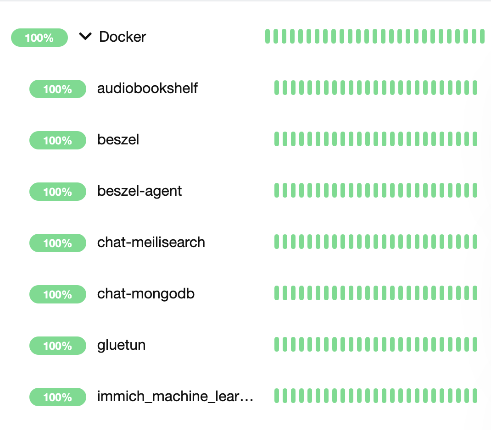

# Kuma Container Sync

Auto-discovers Docker containers on a host and reconciles Uptime Kuma Docker monitors for them, organizing monitors under a host-named group and optionally attaching an existing notification.


## Features
- Discover Docker containers via the Docker socket.
- Create Uptime Kuma Docker monitors for new containers.
- Keep existing monitors grouped under a host-specific monitor group.
- Optionally attach an existing Uptime Kuma notification by name.
- Reconcile periodically using `SYNC_INTERVAL` (idempotent loop).

## Requirements
- Uptime Kuma instance reachable at `KUMA_URL` with a user that can create/edit monitors.
- A Docker Host configured in Uptime Kuma matching `DOCKER_HOST_NAME`.
- Access to the Docker socket on the host (e.g., `/var/run/docker.sock`).

## Environment Variables
- `KUMA_URL` (default: `http://uptime-kuma:3001`): Base URL of your Uptime Kuma instance.
- `KUMA_TOKEN` (required): Uptime Kuma API token.
- `DOCKER_HOST_NAME` (required): Name of the Docker Host entry in Uptime Kuma to associate container monitors with.
- `KUMA_GROUP_NAME` (default: value of `DOCKER_HOST_NAME`): Monitor group name to place all container monitors under.
- `NOTIFICATION_NAME` (optional): Name of an existing Uptime Kuma notification to attach to created monitors. If not found or not provided, monitors are created without notifications.
- `SYNC_INTERVAL` (default: `300`): Seconds to wait between sync runs.

See [monitor.py](monitor.py) for details.

## Quick Start (Docker)
Build the image:

```bash
docker build -t ghcr.io/benrhughes/kuma-container-sync:latest .
```

Run the container (maps Docker socket and sets env):

```bash
docker run -d \
  --name kuma-container-sync \
  -v /var/run/docker.sock:/var/run/docker.sock \
  -e KUMA_URL="http://uptime-kuma:3001" \
  -e KUMA_TOKEN="your-api-token" \
  -e DOCKER_HOST_NAME="Your Docker Host" \
  -e KUMA_GROUP_NAME="Your Host Group" \
  -e NOTIFICATION_NAME="Your Notification" \
  -e SYNC_INTERVAL=300 \
  ghcr.io/benrhughes/kuma-container-sync:latest
```

Notes:
- Ensure `DOCKER_HOST_NAME` matches an existing Docker Host in Uptime Kuma.
- If `NOTIFICATION_NAME` doesn’t exist, monitors will be created without notifications.
 - Image includes a Docker `HEALTHCHECK` that fails if no successful sync has occurred recently (threshold ≈ `2 * SYNC_INTERVAL + 60s`).
 
 Architectures: Multi-arch images are published (linux/amd64, linux/arm64). Docker will select the right variant automatically.

## Create a Docker Host in Uptime Kuma
Before running this tool, create a Docker Host entry in your Uptime Kuma instance:

1. In Uptime Kuma, go to Settings → Docker Hosts.
2. Click “Add New”.
3. Set Name to the exact value you will use for `DOCKER_HOST_NAME`.
4. Configure the Docker connection (e.g., local socket or remote engine) per your Kuma deployment.
5. Save. The name must match `DOCKER_HOST_NAME` so monitors can link to this host.

## Local Run (Python)
```bash
python -m venv .venv
source .venv/bin/activate
pip install -r requirements.txt
export KUMA_URL="http://uptime-kuma:3001"
export KUMA_TOKEN="your-api-token"
export DOCKER_HOST_NAME="Your Docker Host"
python monitor.py
```

## Files
- [monitor.py](monitor.py): Sync logic.
- [Dockerfile](Dockerfile): Container build.
- [requirements.txt](requirements.txt): Python dependencies.

## Compatibility
- This tool targets Uptime Kuma 2.x. Monitor group creation currently uses a low-level client call because a public helper may not be available in all `uptime-kuma-api` versions used in the wild. Dependencies are constrained in [requirements.txt](requirements.txt) to reduce breakage.

## CI: Build and Push to GHCR
This repo includes a GitHub Actions workflow that builds and pushes an image to GitHub Container Registry (GHCR) on tag push (e.g., `v1.0.0`). It uses the built-in `GITHUB_TOKEN` with `packages: write` permission—no extra secrets required.

Tag and push to trigger:

```bash
git tag v1.0.0
git push origin v1.0.0
```

Pull the image 

```bash
docker pull ghcr.io/benrhughes/kuma-container-sync:latest
```

## Roadmap / Ideas
- Optional include/exclude by container labels.
- Auto-create Docker Host in Kuma when missing (if API permits).
- Health metrics and structured logs.

## License
Released under the AGPL-3.0 license. See [LICENSE](LICENSE).